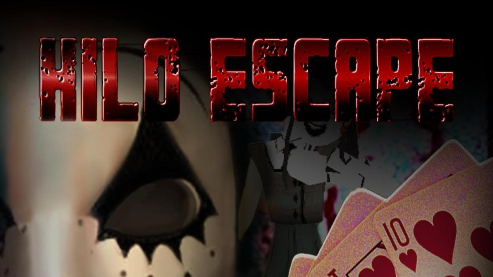

# HiLo Escape

## Concept

**HiLo Escape** is a horror game where you have to guess if you have a higher or lower hand in poker than your opponent. The protagonist has the
the choice to rewind the time or to continue with his choices, but there is always a chance he can die at any moment in any timeline.

## Behind the scenes
The game was made between 5th April and 6th April under 21 hours by 3 students in the same team at *HackItAll*. Here is the list of the teammates:

| Name                      	| Group 	| % of the game | Most important role                	| Roles                        	|
|---------------------------	|-------	|---------------------|------------------------------------	|------------------------------	|
| Caraian Sonia-Adriana[^1]     	| 333CC 	| 33.33         	    | Creating assets and animations     	| Assets + Animations + Coding 	|
| Gîrleanu Andrei-Alexandru[^2] 	| 333CC 	| 33.33         	    | Adding pause and menu logic        	| Animations + Coding          	|
| Nenciu George-Robert[^3]      	| 333CC 	| 33.33         	    | Creating the scene and adding plot 	| Coding + Scene + Music       	|

## Disclaimer
There are some assets with copyright partially modified. The project doesn't get any money and is used only for personal use. Here is a list with the
assets: 
**Random Objects**: https://styloo.itch.io 
**Abandoned House**: https://elbolilloduro.itch.io/abandoned-house 
**Animated FPS Eye Monster**: https://sketchfab.com/3d-models/animated-fps-eye-monster-ef61a173cbfd40d887d71e83bafe6282 
**Animated Casual Male**: https://godotmarketplace.com/shop/animated-casual-male/ 
Music from https://suno.com 

[^1]: https://github.com/soniacaraian
[^2]: https://github.com/andreialex6
[^3]: https://github.com/robertnen
